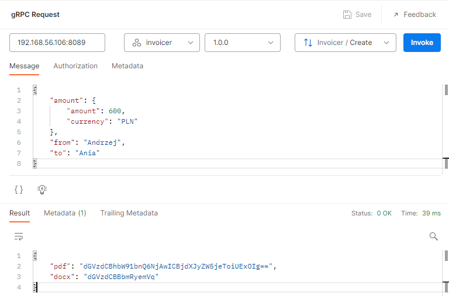

# gRPC Demo
The business case is a server that generates invoices. 

Just look at the [`.protobuf`](invoicer.proto) file how it describes the remote procedure calls. More theory [here](docs/main.md).


## protobuf file

```protobuf
service Invoicer {
    rpc Create(CreateRequest) returns (CreateResponse);
}
```
The service which we are implementing on a business level is an invoice generator. Client passes some information to fill up the invoice and server returns byte files. 

Here, on the protobuf code you can see that service `Invoicer` has a method/procedure `Create`. This method takes some args and return some values. Herein, both of these we call "messages" as this is all remote and we define The Protocol.
```protobuf
message Amount {
    int64 amount = 1;
    string currency = 2;
}

message CreateRequest {
    Amount amount = 1;
    string from = 2;
    string to = 3;
}

message CreateResponse {
    bytes pdf = 1;
    bytes docx = 2;
}
```

## Generating code from protobuf file

```sh
# installation of protobuf complier (protoc) 
# complier creates .go files from .proto files
# provides programming interface in go for .proto defined data structs
sudo apt install protobuf-complier
# interface between protoc a golang
go install google.golang.org/protobuf/cmd/protoc-gen-go@latest
export PATH=$PATH:$(go env GOPATH)/bin
# to create go code in current dir
protoc greet.proto --go_out=$(pwd)
```

But the snippet above will generate only the messages data structs as this is the base protobuf fucntionality.

The generation of code needed to implement a gRPC server lies on the responsibility of `protoc-gen-go-grpc` plugin.
Use the code below then:
```sh
sudo apt install protobuf-complier
go install google.golang.org/protobuf/cmd/protoc-gen-go@latest
export PATH=$PATH:$(go env GOPATH)/bin
go install google.golang.org/grpc/cmd/protoc-gen-go-grpc@latest
export PATH=$PATH:$(go env GOPATH)/bin
protoc --go_out=invoicer --go_opt=paths=source_relative --go-grpc_out=invoicer --go-grpc_opt=paths=source_relative invoicer.proto
```

After issuing this command we have two files in `invoicer/` dir:
- `invoicer_grpc.pb.go` - for implementation of gRPC server
- `invoicer.pb.go` - simple protobuf data structs


# Implementation of gRPC server
First thing you need to do is to implement the interface created in `invoicer_grpc.pb.go`
```golang
// InvoicerServer is the server API for Invoicer service.
// All implementations must embed UnimplementedInvoicerServer
// for forward compatibility
type InvoicerServer interface {
	Create(context.Context, *CreateRequest) (*CreateResponse, error)
	mustEmbedUnimplementedInvoicerServer()
}
```

This is where your business logic lies:

```golang
type MyInvoicerServer struct {
	invoicer.UnimplementedInvoicerServer
}

func (s MyInvoicerServer) Create(c context.Context, r *invoicer.CreateRequest) (*invoicer.CreateResponse, error) {
	return &invoicer.CreateResponse{
		Pdf:  []byte(fmt.Sprintf("test %s", r.Amount)),
		Docx: []byte(fmt.Sprintf("test %s", r.From)),
	}, nil
}
```

When you've done it you can enter the main.go file:
```golang
func main() {
    # 1
	lis, err := net.Listen("tcp", ":8089")
	if err != nil {
		log.Fatalf("Cannot start a listner: %s", err)
	}
    # 2
	grpcServer := grpc.NewServer()
    # 3
	service := &MyInvoicerServer{}
    # 4
	invoicer.RegisterInvoicerServer(grpcServer, service)
    # 5
	err = grpcServer.Serve(lis)
	if err != nil {
		log.Fatalf("Impossible to serve: %s", err)
	}
}
```
Here you have five steps:
1. Open a new tcp listener from OS, later you will use it as a gRPC server
2. Create object that handles all common gGRPC logic of the server. As for now its blank gRPC server. Has no `service` (the on from .proto file) registered and does not accepts incoming tcp connections
3. Create instance of your business logic Server/Handler
4. User protoc-gen generated method to combine the two above with .proto definition. Here we are marrying these 3 things together.
5. Arm your gRPC Server with tco listener

# How to test it

In order to test gRPC Server you need a gRPC Client. Fortunately Postman offers one :smile:.
In order for client to understand your API you need to provide it with `.proto` file. 
You have several methods for that. Event the URI for web file will work.



